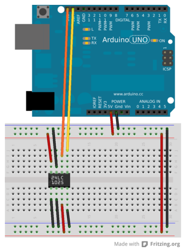

Arduino 24XX1025 EEPROM Library
=============================

__Arduino 24XX1025 EEPROM Library__ is a small library that helps to
interface external 24XX1025 series EEPROMs to Arduino code.

I wrote this library while working on a side project to avoid writing the same
code for each small sketch which uses an external EEPROM chip to store some data.
This small library does the hard work of interfacing the external chip exposing 
a set of common operations which are useful when working with EEPROM chips. 

The following layout ([fritzing file](docs/24LC1025.fzz)) is taken as reference while working with this library using the Arduino UNO R3 board:

Keep in mind that some features are missing but feel free to clone the git repository and send a pull request for any suggestion.

For more info about this project: [http://decabyte.it/projects/arduino-24xx1025-eeprom-library/](http://decabyte.it/projects/arduino-24xx1025-eeprom-library/).

## Usage

Look inside [examples](examples) directory for a couple of usage examples.

## References

* [Microchip 24FC1025 EEPROM](http://www.microchip.com/wwwproducts/Devices.aspx?dDocName=en024639)
* [24XX1025 series datasheet](http://ww1.microchip.com/downloads/en/DeviceDoc/21941K.pdf)
* [TWI Library Reference](http://playground.arduino.cc/Main/WireLibraryDetailedReference)
* [ATmega328 @ Atmel](http://www.atmel.com/devices/atmega328.aspx)

## LICENSE - "MIT License"

Copyright (c) 2012-2013 Valerio De Carolis, http://decabyte.it

Permission is hereby granted, free of charge, to any person
obtaining a copy of this software and associated documentation
files (the "Software"), to deal in the Software without
restriction, including without limitation the rights to use,
copy, modify, merge, publish, distribute, sublicense, and/or sell
copies of the Software, and to permit persons to whom the
Software is furnished to do so, subject to the following
conditions:

The above copyright notice and this permission notice shall be
included in all copies or substantial portions of the Software.

THE SOFTWARE IS PROVIDED "AS IS", WITHOUT WARRANTY OF ANY KIND,
EXPRESS OR IMPLIED, INCLUDING BUT NOT LIMITED TO THE WARRANTIES
OF MERCHANTABILITY, FITNESS FOR A PARTICULAR PURPOSE AND
NONINFRINGEMENT. IN NO EVENT SHALL THE AUTHORS OR COPYRIGHT
HOLDERS BE LIABLE FOR ANY CLAIM, DAMAGES OR OTHER LIABILITY,
WHETHER IN AN ACTION OF CONTRACT, TORT OR OTHERWISE, ARISING
FROM, OUT OF OR IN CONNECTION WITH THE SOFTWARE OR THE USE OR
OTHER DEALINGS IN THE SOFTWARE.
